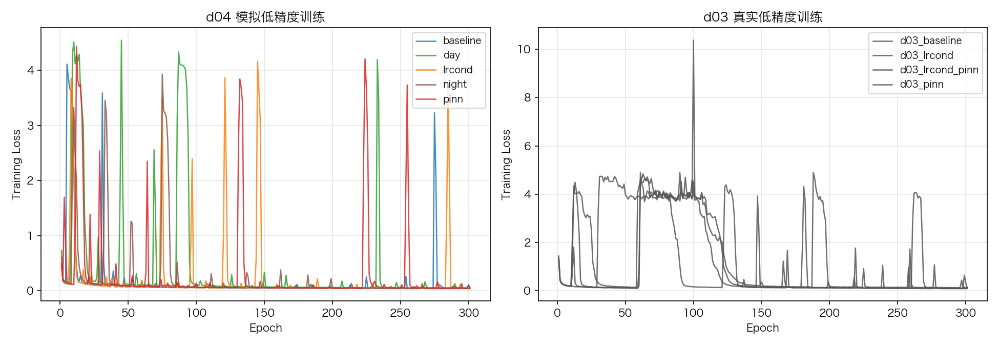
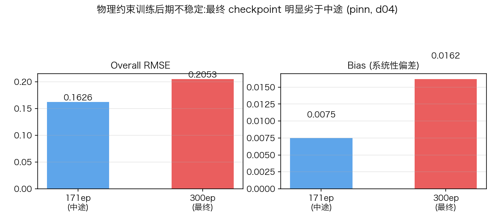
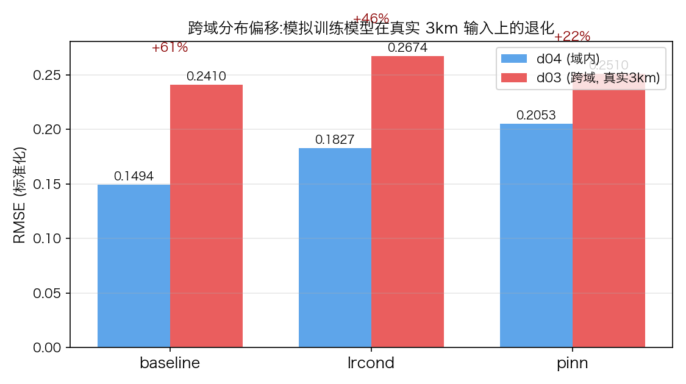
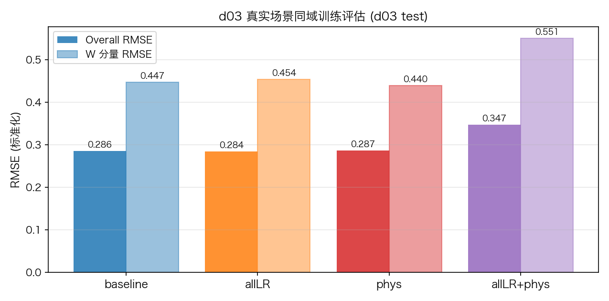
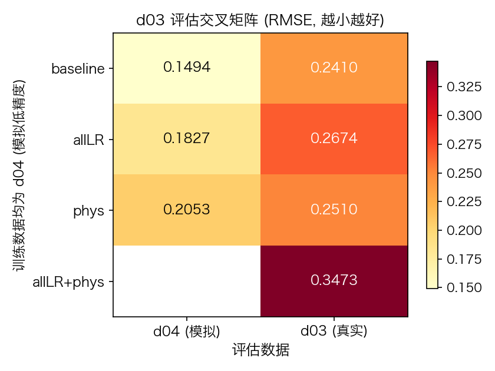

# 组会汇报 — WRF 3D 风场超分辨率:从香港到深圳的数据适配与真实低精度对比

> 日期:2026-08-28

---

## 一、研究背景与问题

### 1.1 从香港到深圳

本项目做 WRF **3km → 1km 三维风场超分辨率重建**。前期在香港数据(2018-07,480 样本)上建立了完整的方法框架,但香港**只有 1km 数据、没有真实的 3km 场**,训练用的低分辨率输入只能由 1km 场降采样构造(模拟低精度)——这是当时的唯一选择。

**本次工作转移到深圳数据**(case01_Shenzhen,2020-07):该数据同时提供 1km(d04)与 **3km(d03)原生输出**,让我们首次能用**真实低精度数据**检验模拟低精度训练的模型,并进一步做真实场景训练。

### 1.2 从香港到深圳需要重新做什么

换到深圳数据,大部分工作要重做:

- **数据准备全部重建**:新的研究区域(96×112 网格)、样本量近 20 倍(香港 480 → 深圳 1 万余)、条件变量从 10 个变为 8 个(深圳模拟没有辐射输出,昼夜改用太阳几何划分)——预处理、统计、配置全部重新做
- **模型和框架直接复用**:同一个 SI 扩散框架、同一套网络结构,只需换成深圳数据的统计量重新训练
- **最大的变化——低分辨率数据终于有两种**:香港只能靠 1km 场降采样"造"出低分辨率输入(模拟低精度);深圳除了模拟降采样,**还有 WRF 自己输出的原生 3km 场(真实低精度)**——两种都能用于训练和评估,这正是本次工作的核心新增

### 1.3 我们在深圳数据集上做的实验

围绕"模拟低精度训练 vs 真实低精度输入",在深圳数据上做了三组实验:

| 实验组 | 内容 | 目的 |
|--------|------|------|
| 对照实验 | 在 d04 降采样(模拟低精度)上训练 5 个模型:主模型 baseline、全低精度输入 allLR、昼夜分训 day/night、物理约束 phys | 建立模拟低精度下的基线表现 |
| **跨域测试** | 把这 5 个模型直接输入真实 3km 数据(d03)评估 | **核心实验**:检验模拟训练的模型在真实数据上是否掉性能 |
| 真实场景训练 | 在原生 d03 上重新训练 4 个模型(baseline / allLR / phys / allLR+phys) | 在真实数据上训练能否恢复性能 |

所有实验都设置了"有无物理约束"的对照(phys 系列),以检验物理约束在两种低精度场景下的作用。具体实验设置见 2.4 节。

---

## 二、方法与数据

### 2.1 模型与输入输出

从外部看,模型就是一个"3km 风场输入 → 1km 风场输出"的黑盒;训练时额外施加物理约束(散度+涡度),让预测场满足质量守恒、不引入虚假旋转。框架细节不再展开。

**模型输入与输出**:

| 类别 | 通道数 | 变量 | 说明 |
|------|:---:|------|------|
| 低分辨率风场 | 18 | U/V/W × 6 层 | **3km 分辨率**,模型主输入 |
| 条件变量 | 8 | t2, z, lu, tsk, hfx, lh, psfc, pblh | 2m 气温、地形高度、土地利用类型、地表温度、感热通量、潜热通量、地表气压、行星边界层高度 |
| **输出(高分辨率风场)** | 18 | U/V/W × 6 层 | **1km 分辨率**,重建目标 |

输入合计 26 通道(18 低分辨率风场 + 8 条件变量),输出 18 通道;6 层为 WRF 垂直坐标 ml0/ml1/ml2/ml3/ml5/ml10(近地面密、高层稀,约 10 m 至 300 m)。

**低分辨率风场的两种来源**:

| 来源 | 怎么来的 | 特点 |
|------|---------|------|
| 模拟低精度 | 把 1km 场每 4×4 格点做平均降到 3km,再平滑插值回 1km 网格 | 与 1km 目标完全对齐,是理想化的降采样 |
| 真实低精度 | WRF 原生 3km 输出,按经纬度重采样到 1km 网格 | 真实的 3km 模式场,平滑度、地形、边界层物理与降采样结果不同 |

**条件变量精度**:每个条件变量都准备了 1km 和 3km 两个版本;基线模型用 1km 版本,全低精度模型(allLR)用 3km 版本。

**数据来源**:所有变量都是 WRF 模式输出(非观测):目标 1km 场来自 d04,低分辨率输入来自 d04 降采样或原生 d03。

**网络结构**:UNet 型网络(约 1900 万参数)。W 分量(垂直风)通道加权 ×10——垂直风量级比水平风小 1–2 个数量级,不加权会被模型忽略。

### 2.2 物理约束设计

约束施加在模型输出的**漂移场 b** 上(而非最终风场),两项共同构成 NS 方程的运动学骨架:

| 约束项 | 表达式 | 含义 | 权重 |
|-------|--------|------|:---:|
| 散度约束 | ∇·b = 0 | 质量守恒 | 0.1 |
| 涡度约束 | ζ(b) = 0(仅大尺度分量) | 不引入虚假旋转 | 0.05 |

涡度约束仅作用于大尺度分量,避免小尺度数值噪声干扰。对照组(纯 L2 损失)两项权重为 0。

### 2.3 数据来源与预处理

**原始数据**:深圳 WRF 模拟输出(case01_Shenzhen,2020 年 7 月),两套 PBL 方案(meso_202007_myj 与 meso_202007_ysu,数据量相同)。每个方案含 **744 个 1km 文件**(每 10 分钟一次输出,每个文件包含 6 个时刻)与 **31 个 3km 文件**(每小时一次输出,每个文件包含 24 个整点时刻)。预处理脚本为本项目自建。

**为什么两个数据集的样本数差 6 倍(8928 vs 1488)**:WRF 对嵌套域的输出频率不同——1km 内层域每 10 分钟输出一个时刻(31 天 × 每天 144 个 = 4464 个时刻/方案),3km 外层域每小时输出一个时刻(31 天 × 24 = 744 个时刻/方案);两个 PBL 方案数据量相同,故合计 8928 与 1488。

#### 2.3.1 模拟低精度数据集(8928 样本)

1. **垂直层**:61 层中取 6 层(ml0/1/2/3/5/10,近地面密、高层稀)
2. **低分辨率输入**:按 2.1 的模拟降采样方法构造(4×4 格点平均降到 3km,再平滑插值回 1km 网格)
3. **区域裁剪**:统一裁剪到 96×112 研究区域
4. **昼夜划分**:该模拟没有短波辐射输出,按太阳高度角(>3° 为白天)划分白天/夜间;黎明黄昏的过渡样本不参与昼夜分析
5. **统计归一化**:用全部样本计算每个变量的均值/标准差

#### 2.3.2 真实低精度数据集(1488 样本)

1. **数据源**:WRF 原生 3km 输出(120×150 网格),每小时一次
2. **网格对齐**:3km 网格与 1km 网格不对齐,按其经纬度坐标把 3km 场重采样到 1km 的网格上
3. **时间对齐**:3km 只输出整点时刻,而 1km 每 10 分钟输出一次、包含所有整点时刻,所以**每个 3km 时刻都能在 1km 中找到同一时刻**(时间戳精确到秒配对)——不存在对不上的时刻,样本的目标场就是该时刻的 1km 真值
4. **裁剪与昼夜划分**:与模拟低精度数据集一致
5. **统计归一化**:用全部 1488 个样本独立计算均值/标准差

**数据规模与昼夜分布**:

| 数据集 | 样本数 | 白天 | 夜间 | 过渡(晨昏) |
|-------|:---:|:---:|:---:|:---:|
| d04 模拟低精度 | 8928 | 4744 | 4026 | 158 |
| d03 真实低精度 | 1488 | 746 | 630 | 112 |

过渡(晨昏)时段:太阳高度角介于昼夜阈值之间的样本(黎明/黄昏),不归入白天或夜间,仅用于全量分析。

**预处理工程**:两套数据集均已完成全量生成、统计与质量校验,细节见 `docs/深圳实验成果记录.md`。

### 2.4 实验设计(全部实验清单)

| 实验 | 训练数据 | 低分辨率风场输入 | 条件变量 | 物理约束 | 目的 |
|------|---------|------------|---------|:---:|------|
| baseline | d04 模拟低精度 | d04 降采样 | 1km 条件 | 无 | 主模型 |
| allLR | d04 模拟低精度 | d04 降采样 | **3km 条件** | 无 | 模拟真实部署的全低精度输入 |
| day | d04 模拟低精度(仅白天) | d04 降采样 | 1km 条件 | 无 | 检验分时训练价值 |
| night | d04 模拟低精度(仅夜间) | d04 降采样 | 1km 条件 | 无 | 检验分时训练价值 |
| phys | d04 模拟低精度 | d04 降采样 | 1km 条件 | 散度 + 涡度 | 运动学约束 |
| baseline-d03 | **d03 真实低精度** | **原生 d03 3km** | 1km 条件 | 无 | 真实场景基准 |
| allLR-d03 | **d03 真实低精度** | **原生 d03 3km** | **3km 条件** | 无 | 真实场景全低精度 |
| phys-d03 | **d03 真实低精度** | **原生 d03 3km** | 1km 条件 | 散度 + 涡度 | 真实场景物理约束 |
| allLR+phys-d03 | **d03 真实低精度** | **原生 d03 3km** | **3km 条件** | 散度 + 涡度 | **全低精度输入 + 物理约束**(真实部署只有 3km 条件可用,最接近实际场景) |

- 训练设置统一:300 轮训练、学习率 5e-4;评估在标准化空间进行(含义见 2.5 节)
- 跨域评估时,输入按 3km 数据集的均值/标准差归一化、目标按 1km 数据集的均值/标准差归一化
- d03 侧条件变量口径与 d04 侧对称(baseline/phys 用 1km 条件、allLR 用 3km 条件),保证同域/跨域结果可比
- 评估维度:全量 / 白天子集 / 夜间子集,以及 U/V/W 分量分解与 SSIM/Corr/bias

**命名说明**(实验名 = 模型变体 + 训练数据后缀):

| 名称 | 含义 | 对应配置 |
|------|------|------|
| baseline | 标准输入:1km 条件、无物理约束 | config_wind_3d_sz_baseline |
| allLR | 全低精度输入:3km 条件、无约束(原 lrcond) | config_wind_3d_sz_lrcond |
| phys | 运动学约束:1km 条件 + 散度/涡度(原 pinn) | config_wind_3d_sz_pinn |
| allLR+phys | 全低精度输入 + 运动学约束(原 lrcond-pinn) | config_wind_3d_sz_lrcond_pinn |
| **后缀 -d03** | **训练数据为真实低精度(原生 d03)**,如 phys-d03 = 在 d03 上训练的运动学约束模型 | config_wind_3d_sz_d03_* |

> 注意区分两个"d03":**"-d03 后缀"指训练数据**;第四节"跨域评估"中的 d03 指**评估数据**。
> 示例:baseline-d03 = 训练于 d03 的同域模型;baseline(无后缀)在 d03 上评估 = 跨域测试。

### 2.5 指标说明(如何读结果表)

所有评估都在**标准化空间**进行:每个变量先减去均值、除以标准差(用各自训练集的统计量),预测与真值在这个空间里比较。因此 RMSE 等数值是**无量纲的**:1.0 ≈ 随机猜测(预测完全无信息),0.1 ≈ 误差只有真值标准差的 10%。**数值只用于模型间的相对比较,不直接对应物理单位(m/s)**。

| 指标 | 含义 | 范围 | 好方向 |
|------|------|:---:|:---:|
| RMSE 均方根误差 | 预测与真值逐点偏差的"平均幅度",对大幅误差惩罚重 | ≥0 | **越小越好** |
| MAE 平均绝对误差 | 逐点偏差绝对值的平均,比 RMSE 稳健(不受个别极端点影响) | ≥0 | **越小越好** |
| SSIM 结构相似度 | 预测场与真值场的**空间结构**(风场的形态、纹理)相似程度 | 0–1 | **越大越好**(1 = 完全一致) |
| Corr 相关系数 | 预测与真值逐点的线性相关,衡量"空间分布跟得准不准" | -1–1 | **越大越好**(0.95+ 极高) |
| bias 系统性偏差 | 预测场均值 − 真值场均值;正 = 整体高估,负 = 整体低估 | 任意 | **越接近 0 越好** |

**风场分量含义**:U = 东西向水平风(西风为正),V = 南北向水平风(南风为正),W = 垂直风速(上升为正)。垂直风速比水平风小 1–2 个数量级、更难预测,所以表格里 W 的 RMSE 明显大于 U/V 是正常的,不要误读为模型故障。

**术语表(本报告常用)**:

| 术语 | 含义 |
|------|------|
| 模型训练 | 让模型反复"做题"学习的过程:每次看到输入,预测输出,与正确答案比较得到误差,再调整模型参数使误差减小 |
| loss(损失) | 训练误差:模型预测与真值的差距,越小越好;表中 loss 为数值,仅用于观察训练是否收敛 |
| epoch(轮次) | 完整训练一遍全部样本 = 1 epoch;300 epochs = 反复学习 300 遍 |
| checkpoint(检查点) | 训练过程中保存的"模型快照"。训练是逐轮进行的,每个快照对应不同训练进度;本报告用"训练 300 轮的最终模型"指训练结束时的快照 |
| 漂移场 b | 模型内部每步输出的"修正方向场",指示当前风场往哪个方向调整以逼近高分辨率真值;物理约束即施加在这个场上 |
| 物理约束项 | 散度约束(∇·b=0,质量守恒)与涡度约束(ζ(b)=0,不引入虚假旋转),权重分别为 0.1 与 0.05 |

---

## 三、结果一:d04 对照实验(模拟低精度)

### 3.1 训练过程

| 实验 | 训练轮数 | 最终误差 | 备注 |
|------|:---:|:---:|------|
| baseline | 300 | **0.0566** | 对照组 |
| allLR | 300 | **0.0474** | 全 3km 条件输入 |
| day | 300 | 0.0519 | 仅白天样本 |
| night | 300 | **0.0406** | 仅夜间样本,收敛最快 |
| phys | 300 | **0.0543** | 物理约束(散度权重 0.1,涡度权重 0.05);后期误差震荡(0.05~0.10 摆动),最佳模型在中途 |

> **注意**:表内"最终误差"是**训练集**(模型反复学习过的样本)上的误差,只反映对训练数据的拟合程度;**模型在没见过的数据上的表现见 3.2 节**。两者不是一回事:例如 allLR 训练误差最低(0.047),测试误差却高于 baseline(0.183 vs 0.149)——3km 条件输入信息量少,模型更容易"记住"训练样本(过拟合更重),训练误差低反而是个假象;训练误差和测试误差都低的模型(baseline)才是真泛化好。

### 3.2 完整指标表(全量测试集 1384 样本,训练 300 轮的最终模型)

| 模型 | RMSE | MAE | SSIM | Corr | bias |
|------|:---:|:---:|:---:|:---:|:---:|
| baseline | **0.1494** | 0.0935 | **0.9902** | **0.9765** | 0.0127 |
| allLR | 0.1827 | 0.1068 | 0.9890 | 0.9621 | 0.0114 |
| phys | 0.2053 | 0.1101 | 0.9721 | 0.9491 | 0.0162 |

> **读法**:每行是一个模型,行内各列互相印证。重点是**与 baseline 行比较**(每列的差值):例如 allLR 的 RMSE 比 baseline 大 0.033,说明低分辨率条件输入让误差放大约 22%;bias 列看哪个模型更接近 0(整体无系统性高估/低估)。各指标含义见 2.5 节。

### 3.3 分量分解(全量)

| 模型 | U RMSE | V RMSE | W RMSE | U SSIM | V SSIM | W SSIM |
|------|:---:|:---:|:---:|:---:|:---:|:---:|
| baseline | 0.0888 | 0.0947 | 0.2648 | 0.9988 | 0.9993 | 0.9726 |
| allLR | 0.0954 | 0.1117 | 0.3409 | 0.9987 | 0.9992 | 0.9692 |
| phys | 0.0933 | 0.1192 | 0.4035 | 0.9997 | 0.9984 | 0.9183 |

> **读法**:U/V/W 分别对应东西风、南北风、垂直风(见 2.5 节)。三个模型对水平风 U/V 的 RMSE 都很小(≈0.09–0.12)、SSIM 接近 1,说明水平风场基本还原;差距主要在 **W(垂直风)**:baseline RMSE 0.265、phys 0.404——物理约束模型对最难预测的垂直风退化最明显。

### 3.4 主要结论

1. **baseline 综合最优**:U/V 分量 SSIM 达 0.999,水平风场恢复质量极高;W 分量难度最大(RMSE 0.265),与既有研究一致
2. **allLR 性能下降(RMSE 增加 22%)**:低分辨率条件变量信息量减少,但这更接近真实部署条件,其价值体现在跨域测试(第四章)
3. **phys 最终模型明显劣化(RMSE +37%,W 分量 +52%)**:物理约束训练后期不稳定——误差在 0.05~0.10 间震荡(正常波动 + 物理项尖峰),300 轮训练结束的状态落在较差位置;171 轮的中途模型 评估 RMSE 0.163,远优于最终 0.205
4. **phys 的"低偏差"优势在最终版本不成立**:早期评估(171 轮中途)观察到的"bias 较 baseline 低 41%"在最终模型上消失——最终 bias +0.016 反而高于 baseline +0.013
5. **重要工程发现**:固定权重的物理约束全程训练不稳定,**最佳模型在中途**——此类训练需要早停或权重调度策略
6. **昼夜分时训练未获得增益**:day 模型在白天子集上未优于 baseline,数据减半未换来专注优势(负结果,可写入论文)

---

## 四、结果二:跨域测试(真实低精度)——核心结果

**设置**:第一轮模型(d04 训练)直接评估于原生 d03 输入(231 个测试样本),输入归一化采用 d03 统计、目标采用 d04 统计,量化"模拟低精度训练 → 真实低精度输入"的分布偏移。

### 4.1 分布偏移量化(d04 → d03,训练 300 轮的最终模型)

| 模型 | d04 RMSE | d03 RMSE | RMSE 增幅 | SSIM(d03) | Corr(d03) | bias(d03) |
|------|:---:|:---:|:---:|:---:|:---:|:---:|
| baseline | 0.1494 | 0.2410 | **+61%(1.61x)** | 0.9881 | 0.9283 | 0.0085 |
| allLR | 0.1827 | 0.2674 | +46%(1.46x) | 0.9451 | 0.9066 | 0.0093 |
| phys | 0.2053 | 0.2510 | +22%(1.22x) | 0.9782 | 0.9233 | 0.0158 |

> **读法**:对每个模型,左列是**域内**(1km 模拟输入)表现,右列是**真实 3km 输入**下的表现——模型一模一样,只有输入数据不同。增幅 = 误差放大的比例:baseline 放大 61% 意味着"把模拟训练模型直接用于真实 3km 数据,误差增加六成";增幅越小说明模型对输入分辨率变化越不敏感。bias 列看整体高估/低估程度(接近 0 最好)。各指标含义见 2.5 节。

### 4.2 分量增幅(d03/d04 RMSE 比值)

| 模型 | U | V | W |
|------|:---:|:---:|:---:|
| baseline | 1.33x | 1.53x | **1.74x** |
| allLR | 1.28x | 1.35x | 1.55x |
| phys | 1.29x | 1.30x | **1.18x** |

### 4.3 主要结论

1. **分布偏移真实且显著(+22~61% RMSE)**:模拟低精度训练的模型在真实 3km 输入上性能显著下降——"合成降采样与真实低精度不一致(synthetic vs real degradation)"这一超分领域经典问题的直接实证
2. **W 分量性能下降幅度最大**(baseline 1.74x):垂直风对分辨率降低最敏感(U 1.33x, V 1.53x),垂直运动尺度小、对网格平滑的响应更剧烈
3. **phys 相对退化幅度最小(+22%,W 分量仅 1.18x)**:物理约束使预测场对输入退化更"迟钝";但注意其绝对精度仍低于 baseline(d03 上 RMSE 0.251 vs 0.241,W 0.478 vs 0.460)——phys 的优势是"退化幅度小",不是"绝对更好"
4. **空间结构基本保持、逐点数值漂移**:SSIM 基本稳定(baseline 0.988),Corr 下降 0.05——模型学到的是结构先验,但逐点数值在真实低精度下发生漂移

---

## 五、结果三:真实场景训练(实验三)

**设置**:在原生 d03 上重新训练 baseline-d03 / allLR-d03 / phys-d03 / allLR+phys-d03(与 d04 侧同口径),评估于 d03 测试集(231 样本),构成完整四格交叉矩阵(训练数据 d04/d03 × 评估数据 d04/d03)。

### 5.1 训练情况

| 模型 | 状态 | 最终误差 |
|------|:---:|:---:|
| baseline-d03 | 完成 | 0.0906 |
| allLR-d03 | 完成 | 0.1484 |
| phys-d03 | 完成 | 0.1100 |
| allLR+phys-d03(全低精度+约束) | 完成(导师要求补充) | 0.1265 |

> **读法**:浅色柱是 Overall(总误差)、深色柱是 W 分量(垂直风)误差;四个模型同场比较——allLR+phys 两柱都明显最高(误差最大),其余三个模型总体相当(allLR 略优)。完整的同域评估数字见 5.2 节的交叉矩阵表。

### 5.2 交叉矩阵(d03 评估,RMSE,训练 300 轮的最终模型)

| 训练数据 | baseline | allLR | phys | allLR+phys |
|---------|:---:|:---:|:---:|:---:|
| d04 训练(跨域,第四章) | 0.2410 | 0.2674 | 0.2510 | —(未训练) |
| **d03 训练(同域)** | 0.2857 | **0.2842** | 0.2870 | 0.3473 |

> **读法**:所有数字都是在**真实 d03 数据上评估**的 RMSE。行 = 训练数据(第一行训练于模拟 1km 降采样,第二行训练于真实 3km),列 = 模型变体;**同一列上下比较**回答核心问题:"训练于真实 3km(baseline-d03, 0.286)是否比训练于模拟数据再跨域部署(baseline, 0.241)更好?"——答案是更差,理由见 5.3 节。列间比较看模型变体优劣;同一行内 allLR+phys(0.347)最差。

### 5.3 关键对比

**1. 真实场景同域训练未收回偏移损失,反而比跨域更差(0.286 vs 0.241~0.251)**。两个原因:
- **任务本质不同(主因)**:d03 是 3km 平滑场插值到 1km 网格,**1km 细节在源头已不存在**,模型无法凭空恢复(信息不可逆);而模拟低精度是 4×4 格点平均,低频信息完整保留,模型只需逆转平均过程,任务容易得多
- 训练样本量差异:d03 训练 1488 vs d04 训练 8928

**2. phys 的 bias 优势不成立**:最终模型下 d04 内 phys bias(+0.016)已高于 baseline(+0.013);d03 同域同样(phys +0.036 vs baseline +0.020)——物理约束未能降低系统性偏差(此前的 -41% 来自中途模型的偶然状态)。

**3. phys 的 W 分量优势弱化**:d03 同域 phys W(0.4397)略优于 baseline(0.4474),但 d04 域内与跨域评估中 phys W 均差于 baseline——"物理约束使垂直风更鲁棒"的证据仅在真实同域场景微弱存在,整体不稳健。

**4. allLR 在真实场景不再劣势**:同域 allLR(0.2842)略优于 baseline(0.2857)——真实部署中条件变量本来就只有 3km,全低精度输入是合理且无损的选择(与模拟场景相反)。

**5. allLR+phys 组合最差(0.3473)**:全低精度输入与物理约束两个"降级"因素叠加,W 分量显著恶化(0.551)。

**6. baseline-d03 SSIM 异常低(0.801,其余 0.86~0.98)**:RMSE 与 allLR 相近但空间结构相似度差很多,疑为系统性结构误差,待复查。

---

## 六、总结与下一步

### 主要发现

1. **模拟低精度上 baseline 综合最优**:U/V 分量 SSIM 达 0.999,水平风场恢复质量极高;W 分量难度最大(RMSE 0.265),与既有研究一致
2. **跨域分布偏移 +22~61% 已量化**:模拟低精度训练的模型在真实 3km 输入上性能显著下降,直接实证了"合成 vs 真实低精度"问题;W 分量最脆弱(baseline 增幅 1.74x)
3. **物理约束(固定权重全程训练)在深圳数据上不成功,但暴露了关键工程问题**:训练 300 轮的最终模型明显劣于中途(0.205 vs 171 轮的 0.163),训练后期误差震荡——物理约束训练需要早停/权重调度/两阶段策略;其"抗退化"仅体现在相对增幅小(phys +22% vs baseline +61%),绝对精度不占优
4. **真实场景同域训练反而更差(0.286 vs 跨域 0.241)**:d03 的 1km 细节在源头缺失,逆问题不可恢复;模拟池化 LR 信息完整、任务容易——"真实低精度训练"并非简单补救,数据工程需另行设计(如数据增强、与 d04 联合训练)

### 下一步工作

| 优先级 | 任务 | 说明 |
|------|------|------|
| 1 | **NS 完整动量残差约束**(核心目标) | 当前仅运动学约束(散度+涡度)。深圳 WRF 输出具备三维气压、温度、密度、TKE 等变量,动量方程各项(平流、气压梯度力、科氏力、湍流扩散)均可构造残差约束——这是既有香港数据无法实现的工作 |
| 2 | **d03 同域训练提升**(负结果补救) | 真实同域训练比跨域更差:尝试 d04+d03 联合训练、数据增强、更大模型,或接受"跨域部署+微调"路线 |
| 3 | 物理指标:预测场散度/涡度残差直接对比 | phys vs baseline,量化运动学约束满足程度 |
| 4 | d03 评估加固 | 当前 231 个测试样本统计噪声较大,计划扩展至全量 1488 评估 |
| 5 | baseline-d03 SSIM 异常复查 | SSIM 0.801 与其他模型差异过大,检查是否系统性结构误差 |

---

> 注:本报告所有数字源自 `docs/深圳实验成果记录.md`(持续更新);四格交叉矩阵已完整(2026-08-26)。

<!--
待办清单(2026-08-26 已完成):
1. ✅ 第三章 phys 最终误差(300 轮)
2. ✅ 第五章 5.1 四个 d03 模型最终误差
3. ✅ 第五章 5.2/5.3 四格交叉矩阵完整数字与结论
4. ✅ 摘要填写
5. 配图(与 md 同目录,相对路径引用):四个训练任务的 误差曲线、d03 评估对比图
-->
