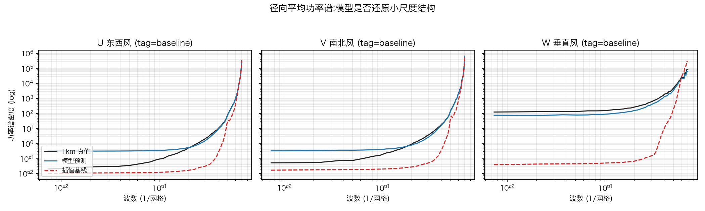

# 组会汇报:主流大气降尺度文献学习与下一步实验计划

## 一、八篇论文共同的实验设计方法

1. 插值法作为baseline

2. **与简单方法对比**：除自身方法外,使用直接回归网络检验复杂模型是否带来实质增益。

3. **多维度评价**：总体误差之外,按风速分箱、按垂直层分解、以能谱检验小尺度结构;生成模型还须检验集合可信度。

4. **泛化能力测试**：在陌生地形区、不同模式系统或年份上检验。Ericson 等以三个陌生地形区测试,给出泛化失效边界。

5. **观测或业务验证**：以测风塔或业务模式输出为对照。Benton 等用乌克兰测风塔验证跨洲迁移的模型。

---

## 二、各篇论文的任务与创新点

> 读法:加粗的 4 篇为指定重点文献。任务列说明论文完成的工作,创新列说明其贡献所在。表后给出三条规律。

| 论文 | 任务 | 创新点 |
|------|------|--------|
| **Benton,美国** | 将 30 km 全球再分析风场超分为 2 km、5 分钟间隔的风资源场,用于风电规划 | 首次采用真实低分辨率再分析与真实高分辨率模式输出的配对训练,而非对高分辨率场人为粗化;北美训练的模型直接应用于乌克兰 24 年数据,并以测风塔验证 |
| **Ericson,瑞士** | 将 9 km 全球预报降尺度至 1 km 地面风场 | 对九种直接回归网络进行公平对比,证明其误差可比简单插值降低三分之一以上;提出强风段的专项处理;证明高分辨率地形是最重要的输入变量 |
| **CorrDiff,NVIDIA 与台湾气象部门** | 将 25 km 全球再分析降尺度至 2 km 的 2 m 气温、10 m 风与雷达回波 | 提出两步式结构:回归网络先给出大致正确的均值场,扩散模型仅对残差建模,显著降低生成难度;并建立能谱、概率分布与集合可信度的系统评价体系 |
| **Sun,中国气象局** | 将上述框架扩展至中国区域,25 km 降至 3 km,并覆盖 6 层高空三维场 | 框架复现加扩展的代表:区域面积扩大约 40 倍仍可训练,多数变量误差低于业务区域模式 CMA-MESO,证明该路线可替代区域数值预报 |
| Dettling,美国 NCAR | 将约 1 km 风场超分至 30 m,重建复杂地形湍流结构 | 以能谱与高阶统计证明生成场与 LES 一致;在地形特征完全不同的区域仍可外推;计算成本较 LES 低约四个数量级 |
| Kurihanna,短文 | 900 m 三维风场超分至 100 m | 引入垂直层间注意力机制,以正则化方式使网络内部表征捕捉垂直对流过程;与我们的任务最接近,属早期探索性工作 |
| Wu,上海交大 | 湍流场超分,训练数据极少 | 以单一数据集训练按湍流尺度索引的专家模型库,推理时估计尺度并调用对应专家,可在未见过的流动类型上直接使用;物理约束采用自适应权重,训练稳定 |
| Zhou,港科大广州 | 发布含深圳、香港在内的五座城市街区尺度风场数据集与基准 | 大规模数据工程;实证结论:样本极少时,基于数据低维先验的同化方法误差仅为深度学习方法的一半 |

三条规律:

1. 技术路线分为扩散生成、GAN 生成与直接回归三类,当前主流是先由回归网络给出均值场、再由生成模型补充细节的两步式结构。
2. 输入均为粗分辨率模式场加地面与地形条件;仅我们与 Kurihanna 的工作涉及含垂直风的垂直多层风场,其余多限于地面一层。
3. 多数论文的粗网格场与细网格场来自两套不同的模式系统,混杂了模式间差异;我们的 d03 与 d04 出自同一次 WRF 模拟的嵌套输出,二者差异仅在于分辨率。

---

## 三、八篇论文共同的流程骨架

8 篇论文的整体流程一致:数据采集与配对、输入构造、模型训练、推理、评估。下表列出各篇共性做法与我们的对应情况,作为自查。

| 步骤 | 主要工作 | 论文中的共性做法 | 我们的对应情况 |
|------|---------|-----------------|---------------|
| 1 数据采集与配对 | 获取粗、细两套分辨率的场,按同一时刻配对成训练样本 | 粗场多为全球模式或再分析,细场为区域模式或 LES,两者多来自不同模式系统 | d03 与 d04 出自同一次 WRF 模拟的嵌套输出,时间戳精确到秒配对;同时具备真实与模拟两种低精度输入 |
| 2 输入构造 | 粗场插值到细网格,与静态条件拼接,逐变量标准化 | 高分辨率地形等静态变量作为条件输入;按训练集统计量标准化;预先确定输入与输出变量清单 | 三维风场 18 通道加 8 个条件变量;条件变量备有 1 km 与 3 km 两个精度版本,供全低精度实验使用 |
| 3 模型训练 | 选定模型族在训练集上训练,设计损失,按验证集判断收敛 | 分回归、GAN、扩散三类;损失中常含保均值、保极值等项;收敛判断结合物理诊断,不只看损失 | SI 扩散框架训练 300 轮,训练中施加散度与涡度物理约束;已发现固定权重在训练后期不稳定,最佳模型在中途 |
| 4 推理 | 在测试时段或区域上生成细网格场 | 生成模型多次采样得到集合;大区域分块推理并处理接缝 | 目前为单次采样推理;集合采样尚未开展 |
| 5 评估 | 对输出做多维度评价 | 误差指标、分风速与分层考察、谱与分布检查、集合可信度、观测或业务对比 | 已有误差指标与插值基线;本次补充谱、分层、分箱与条件敏感性;泛化测试与观测验证待开展 |

> 读法:第 1、2 步为数据条件,同源嵌套配对为文献中未见;第 3、4 步流程完整,推理环节尚未利用集合采样;第 5 步本次基本补齐,剩余短板是泛化测试与观测验证。

---

## 四、对照我们工作的三点认识

1. **数据条件具有独特性**。多数论文的粗、细网格场来自两套模式系统,混杂模式间差异;我们的 d03 与 d04 出自同一次 WRF 模拟,且同时包含模拟与真实两种低精度输入,可在干净条件下研究两者的部署差距,该对照在现有文献中未见。

2. **外部参照已补齐**。插值 baseline 已完成:模拟数据上模型 RMSE 0.149、插值 0.309,降低 52%;垂直风 W 分量改善最显著,0.710 降至 0.265,降低 63%,说明 3 km 场中垂直风信息几乎缺失。跨域测试中模型 RMSE 0.241,仍优于插值 0.334,降低 28%。结果表明模型学到的是有效的超分映射而非插值平滑。评估类实验见第五部分。

3. **扩散模型的概率能力尚未利用**。主流工作以多次采样生成集合,报告集合均值与方差同误差的关系;我们目前仅报告单次采样误差,计划下一步补充。

---

## 五、评估实验结果与下一步计划

### A 组:评估实验结果

本组在现有三个模型上完成,不涉及重新训练,用于补充多维度评价指标,对应第一节共同做法中的第三、四条。评估在 1384 个测试样本上进行,与既有评估同口径。

**A1 能量谱诊断**

该步骤参考了论文:Mardani 等(2025,CorrDiff)、Dettling 等(2025)、Wu 等(2025)。

对模型预测场、1 km 真值与插值结果分别计算径向平均功率谱,比较三者在小尺度上的能量分布,对应其以功率谱检验细节还原程度的标准做法。

结果:高波数段谱功率与真值的比值,1.0 表示完全一致

| 分量 | 模型/真值 | 插值/真值 |
|------|:---:|:---:|
| U 东西风 | 0.97 | 1.00 |
| V 南北风 | 0.96 | 1.01 |
| W 垂直风 | **0.78** | **2.50** |

解读:水平风上模型与插值均接近真值;垂直风上插值谱功率达真值 2.5 倍,即插值产生了大量并不存在的小尺度能量,模型无此问题。垂直风重建是本任务的核心增益,也是区分模型与插值的关键分量。

**A2 逐层误差分析**

该步骤参考了论文:Sun 等(2026)。

对六个垂直层分别报告误差,考察误差在垂直方向的分布,对应其 6 层高空变量逐层评估的做法。

结果:

| 垂直层 | baseline | allLR | phys | 插值基线 |
|--------|:---:|:---:|:---:|:---:|
| ml0 | **0.1303** | 0.1627 | 0.1926 | 0.3425 |
| ml1 | **0.1265** | 0.1634 | 0.1868 | 0.3238 |
| ml2 | 0.1358 | 0.1703 | 0.1923 | 0.3106 |
| ml3 | 0.1477 | 0.1800 | 0.2005 | 0.3029 |
| ml5 | 0.1636 | 0.1966 | 0.2190 | 0.2931 |
| ml10 | 0.1923 | 0.2227 | 0.2382 | 0.2811 |

> 读法:表内为 RMSE。三个模型在每一层都显著优于插值基线;误差随高度递增,最上层约 300 m 处小尺度结构最丰富、重建难度最大。插值基线误差随高度反而略降,说明 3 km 场在高层更平滑、可推断信息更少。

**A3 强风段误差**

该步骤参考了论文:Ericson 等(2025)。

按近地面真值风速分为两个区间分别统计误差,对应其按风速分箱评估、专门处理强风段的做法。

结果:

| 风速段 | 样本数 | baseline | allLR | phys |
|--------|:---:|:---:|:---:|:---:|
| 0 至 5 m/s | 627 | **0.1475** | 0.1674 | 0.1729 |
| 5 至 10 m/s | 757 | **0.1497** | 0.1926 | 0.2272 |

> 读法:baseline 两段持平;allLR 与 phys 在强风段误差上升更多——条件变量降级与物理约束的代价在强风时被放大,真实部署中的风险主要集中在强风时段。

**A4 条件变量贡献**

该步骤参考了论文:Ericson 等(2025)。

逐一打乱单个条件变量的空间结构后重新推理,考察误差上升幅度,对应其输入变量敏感性分析的做法。

结果:

| 条件变量 | 打乱后 RMSE | 上升幅度 |
|---------|:---:|:---:|
| 地形高度 z | 0.738 | 0.589 |
| 地表气压 psfc | 0.511 | 0.361 |
| 2 m 气温 t2 | 0.349 | 0.200 |
| 地表温度 tsk | 0.320 | 0.171 |
| 土地利用 lu | 0.268 | 0.119 |
| 潜热通量 lh | 0.261 | 0.112 |
| 感热通量 hfx | 0.188 | 0.038 |
| 边界层高度 pblh | 0.172 | 0.023 |

> 读法:基准误差 0.149。地形高度最重要,打乱后升至 0.738,与文献"高分辨率地形是最重要输入"一致;边界层高度贡献最小,与香港消融结论一致。全低精度模型性能下降即源于此——地形、气压、气温正是精度最高、降级损失最大的三个变量。

**A5 跨方案泛化**

该步骤参考了论文:Ericson 等(2025,陌生地形区泛化)、Zhou 等(2026,方向留出泛化)。

深圳数据含 MYJ 与 YSU 两套边界层参数化方案,将两方案样本各自按 70/15/15 独立切分,模型分别评估两方案的留出测试切片。

需说明一处此前未察觉的数据划分问题:官方切分按文件名排序取尾部 15.5% 作为测试集,而排序中 MYJ 全部在前,导致测试集实际**全部为 YSU 样本**、MYJ 从未进入测试。本项按方案独立切分,补齐 MYJ 的留出评估。

结果(每方案留出 692 样本):

| 方案 | RMSE | SSIM | Corr | W 分量 RMSE |
|------|:---:|:---:|:---:|:---:|
| MYJ | 0.1607 | 0.9735 | 0.9820 | 0.2777 |
| YSU | 0.1578 | 0.9937 | 0.9776 | 0.2754 |

> 读法:两方案留出误差相差约 2%,模型对边界层参数化方案无系统性偏好。局限:两方案样本均出现过在训练集中,本项为同方案留出泛化,并非未见方案的迁移;后者需单一方案训练、另一方案测试,列入 C 组。

**A6 域差来源分析**

该步骤参考了论文:Benton 等(2025)。

跨域评估中原按 d03 侧统计量归一化输入,现改用 d04 侧统计量归一化作为对照,检验统计偏移在跨域误差中的贡献,对应其在输入侧做矩匹配的做法。

结果:两种口径下误差分别为 0.241 与 0.238,差异不足 2%。跨域误差并非由均值方差主导,而来自两套数据的空间结构差异——简单统计校正无法缩小跨域差距,后续方向应指向结构层面的域适应。

### B 组(下一步):集合评估

对同一输入采样 10 至 20 次,报告集合平均误差与成员离散度,检验不确定度与实际误差的关系。不需要新训练。

### C 组(下一步):方法对照与训练改进

- 训练不引入扩散机制的直接回归网络,同数据、同设置对比,回答扩散框架相对直接回归的增益。
- 物理约束的固定权重改为自适应权重,解决训练后期震荡、中途模型最优的问题。

### 排期

B、C 两组尚未开展,按优先级依次启动。关于实验顺序,恳请老师提出意见。

---

> 注:本报告已有数字均与 docs/深圳实验成果记录.md 一致;A 组结果产生后同步更新本报告与记录文档。各篇论文详细摘要见 docs/论文总结,分析过程见 docs/主流降尺度文献与深圳超分结合分析.md。
