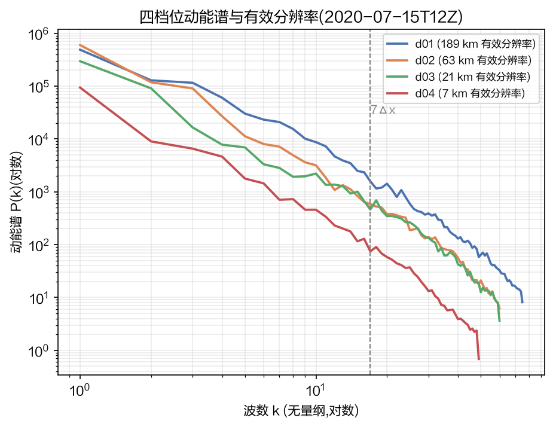
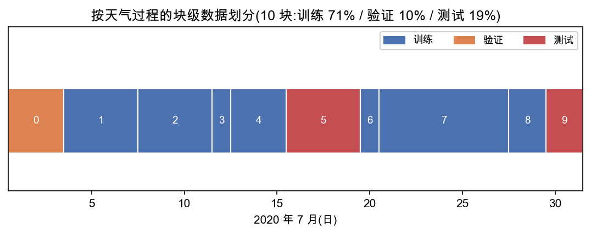
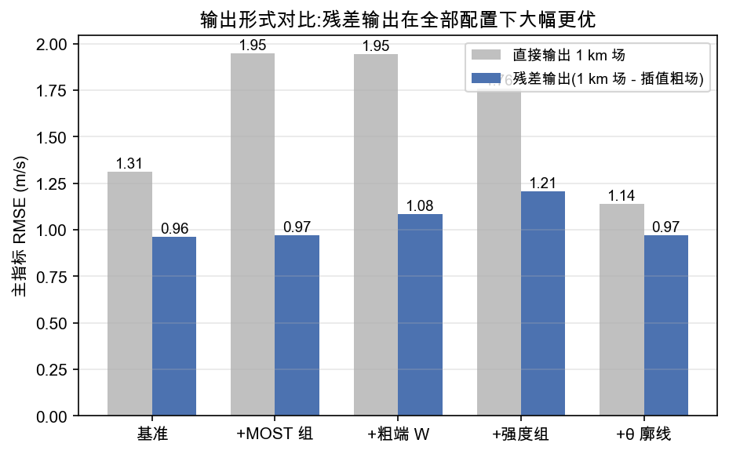
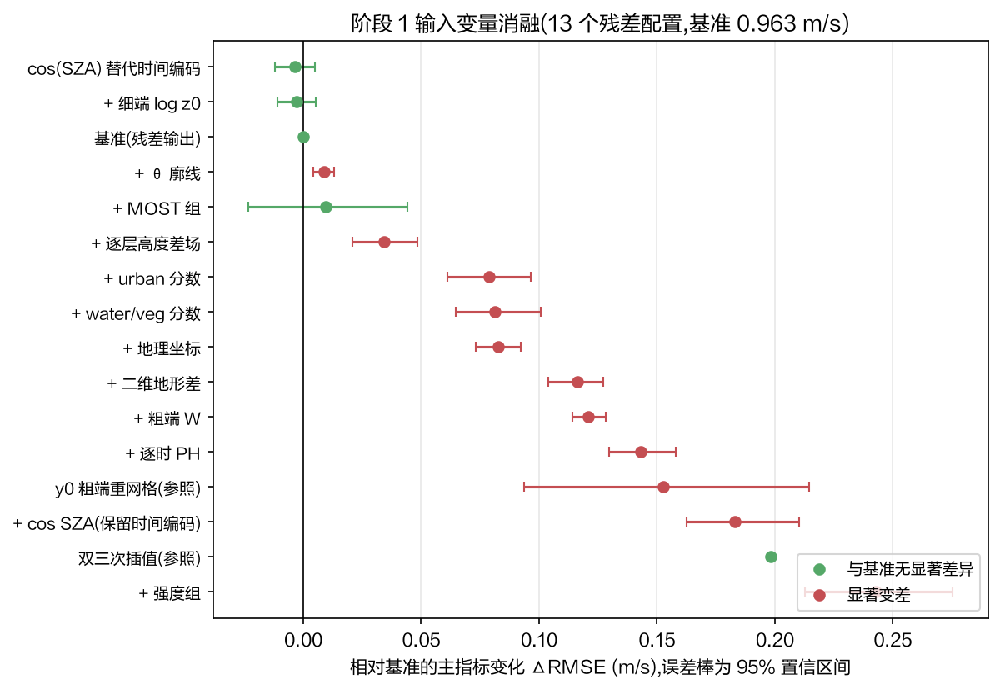
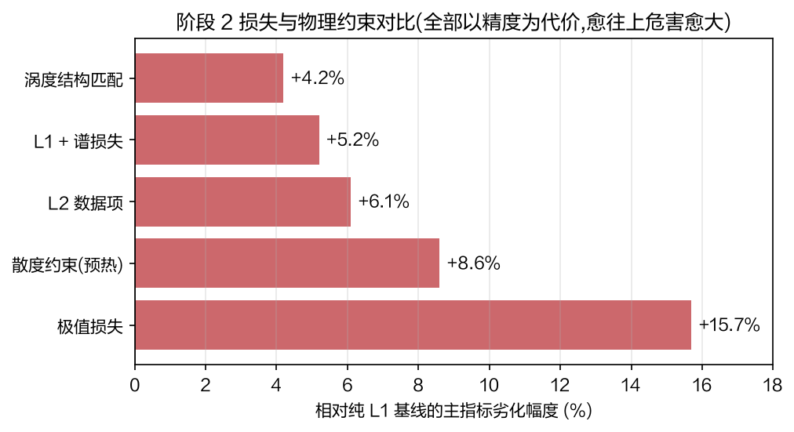
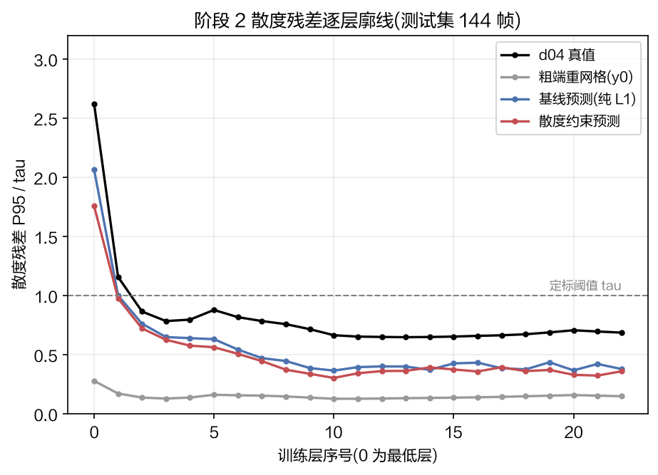
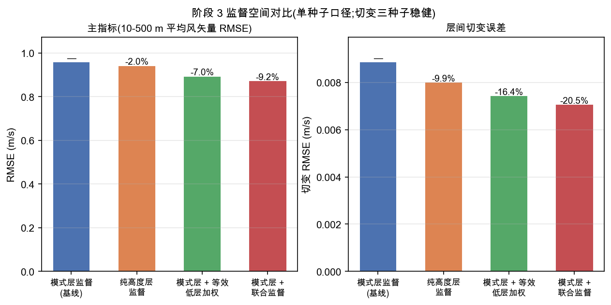
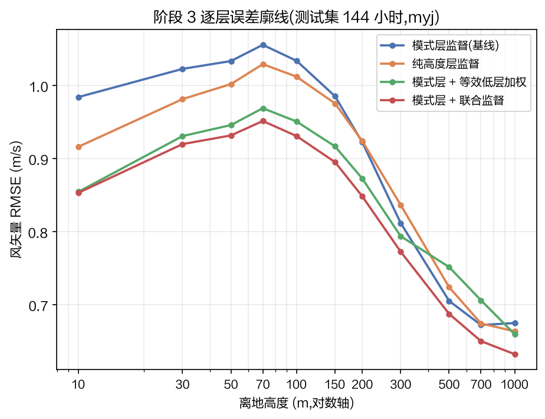
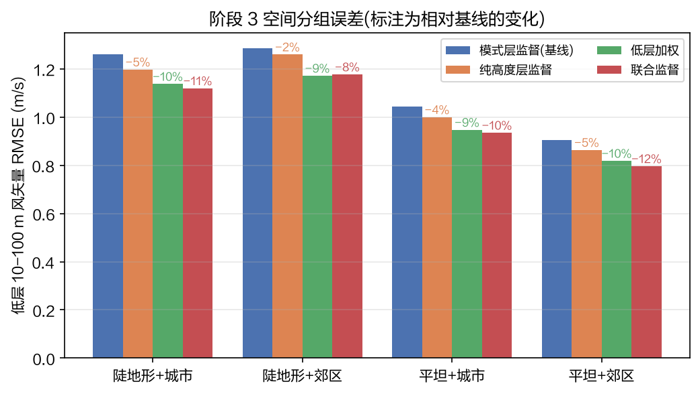

# 组会汇报:研究大纲阶段进展(阶段 0 至阶段 3 前部)

> 汇报日期:2026 年 10 月 9 日

上次汇报后,研究工作已按导师大纲全面调整:开发档位改为 9 km 至 1 km,评估空间改为离地高度层,并重建了数据与训练管线。目前阶段 0 至阶段 3 前部已完成,本次汇报各阶段的做法与结论,以及正在进行的架构对比与下一步安排。早前的 3 km 跨域实验管线已冻结保留,其结果后续可作为方法对照。

总体实验规模如下表,四个阶段合计约 50 次完整训练,全部在统一的评估链与显著性检验下比较。

| 阶段 | 训练配置数 | 核心产出 | 状态 |
|------|:---:|----------|------|
| 阶段 0 数据工程与协议冻结 | — | 新数据管线、离地高度评估算子、块级划分 | 完成,检查点 A 冻结 |
| 阶段 1 输入变量消融 | 28(15 直接输出 + 13 残差) | 最优输入集 V\*、边际贡献排序 | 完成,含两轮迭代 |
| 阶段 2 损失函数与物理约束 | 15 | 最优损失 L\*、稳定性配方 | 完成,含崩塌诊断与修复 |
| 阶段 3 监督空间对比与架构对比 | 7(4 臂 + 3 种子) | 监督方式结论;架构对比进行中 | 监督空间完成,架构对比训练中 |

---

## 一、数据基础与协议冻结(阶段 0,T0.1 至 T0.8)

开发档位为 9 km 至 1 km:粗端取 d02,细端取 d04。数据为深圳 2020 年 7 月,固定 myj 参数化方案。

**数据管线(T0.1)**:细端 d04 共 744 文件、每个文件 6 帧,合计 4464 帧;粗端 d02 整点 744 帧,两端按整点一一对齐。抽取产物为细端 8928 份样本与粗端 1488 份样本。细端只存监督目标,所有逐时输入量一律只从粗端取,防泄漏由数据结构保证,不依赖约定。

**训练空间(T0.2)**:保留 WRF 原生 Arakawa C 网格交错位置,不做插值对齐;训练层为 1 km 以下的 20 层加 3 层背景层,共 23 层。标准化规则要点:风分量只缩放不平移,以保持风矢量几何与辐散结构;粗端与细端统计各自独立,不共用;统计量只在训练块上计算。

**评估空间(T0.3、T0.4)**:交付与评估统一到 11 个离地高度层,即 10、30、50、70、100、150、200、300、500、700、1000 m,按对数高度线性插值;预测与真值共用同一算子,10 m 由诊断通道承担。往返试验显示插值算子本身引起的误差约为信号尺度的 11%,而同期降尺度任务的误差在 31% 量级,插值不是误差主导项,离地高度空间上的评估结论可信。

**数据划分(T0.6)**:按天气过程把一个月切分为 10 个连续块,块级分配训练、验证、测试,比例约 71%、10%、19%,留出块互不相邻。该划分同时解决了旧划分中两种参数化方案混入同一测试段的问题。块表已于 9 月 27 日冻结,记为检查点 A,此后所有对比在同一划分上进行。

**真值诊断(T0.5)**:四项结论。其一,各档位动能谱在约 7 倍格距之后一致变陡,与模式有效分辨率的预期一致。其二,测定了 d04 在原生网格上的散度残差量级,作为阶段 2 物理约束的定标基准。其三,9 km 场与 1 km 真值之间未检出系统性位置偏移,位移不是本档位误差的来源。其四,myj 与 ysu 两套参数化差异显著,近地风速 RMSE 达 1.39 m/s,因此训练固定单一方案,跨方案检验留待阶段 6。

> 读法:上图为四个嵌套档位的动能谱,各档在约 7 倍格距(虚线)之后一致变陡,该尺度即各档的有效分辨率,说明超过 7Δx 的细节不携带可信信息,降尺度目标应定位在这一尺度之上。下图为数据划分,十个连续块按天气过程切分,训练、验证、测试三段互不相邻,避免相邻时刻信息渗漏。

---

## 二、输入变量消融(阶段 1,T1.1 至 T1.7):确定输入集 V\*

固定条件为 UNet、L1 损失、模式层监督。消融覆盖几何通道、近地表与状态变量、太阳强迫编码、下垫面分级、输出形式与坐标泄漏对照。

首要发现是**输出形式的影响远大于任何单个输入变量**:模型直接输出 1 km 场时,15 个配置中 13 个打不过不学习的插值基线;改为输出"1 km 场减去插值粗场"的残差后,同一配置误差降低 27%,13 个残差配置全部优于双三次插值。诊断原因是漂移场估计误差在逐步积分中累积,直接输出下累积误差超过修正收益,残差形式的修正量更小,收益才为正。

> 读法:灰色为直接输出、蓝色为残差输出,五组配置一一对照。残差输出在全部配置下更优,且改变了变量排序——直接输出下表现最差的粗端 W 与强度组,在残差下变为中性或小幅变差,说明直接输出阶段的排序不具参考价值,这也是本阶段重跑全部配置的原因。

**最优输入集 V\* 为**:粗端 U、V 风场(23 层)、粗端逐层离地高度、粗端对数粗糙度、太阳天顶角余弦单通道,以及细端几何场。时间编码用太阳天顶角余弦单通道替代四通道时间编码,两者统计打平,取最简方案。

全部增量输入均未改善误差:近地面相似理论组中性,θ 廓线小幅变差,逐层高度差场、下垫面分级、地理坐标、粗端垂直速度、逐时位势高度等显著变差 3% 至 14%。其中特别写入大纲设计决策的两条得到实证:不输入地理坐标(T1.7),加入坐标后误差反而显著变大,支持坐标不进入网络的规则;粗端垂直速度未带来增量,与预期一致。

> 读法:每个点为一项输入配置相对基准的误差变化,横线为 95% 置信区间,绿色表示与基准无显著差异、红色表示显著变差。零点上方三行(cos(SZA) 替代时间编码、细端 log z0、基准)为最优组;其余全部显著变差,最下方两个灰色参照为不学习的基线。13 个残差配置的完整边际贡献排序即以此图为准。

误差在水平风与垂直风之间分布失衡是限制输入增益的机制:均匀 L1 下垂直风通道贡献约 68% 的损失,水平风只占 32%,网络优化重心不在水平风上,这是阶段 2 转向损失设计的直接原因。

本阶段另有一条工程教训写入流程纪律:第一轮 15 个配置在"直接输出"这一失效形式下训练,约 70 GPU 小时作废。此后固定为"任何批量实验前先跑单点试点,与免费基线比较确认配置可赢,再铺开"。

---

## 三、损失函数与物理约束(阶段 2,T2.1 至 T2.4):确定损失 L\*

在 V\* 与残差输出基础上,对比了 L1、L2、谱损失、极值损失、原生网格散度约束与涡度结构匹配,全部在统一评估链与显著性检验下进行。

| 损失/约束 | 相对 L1 基线的变化 | 判定 |
|-----------|:---:|------|
| L1(基线) | — | 最优 |
| 涡度结构匹配 | +4.2% | 无收益 |
| L1 + 谱损失 | +5.2% | 无收益 |
| L2 | +6.1% | 无收益 |
| 散度约束(预热启动) | +8.6% | 无收益 |
| 极值损失 | +15.7% | 显著有害 |

> 读法:横轴为相对纯 L1 基线的误差劣化幅度,数值愈大表示该损失项对精度的伤害愈大。六项对比全部为正,即全部候选项以精度为代价,其中高阶统计量类损失(谱与极值)危害最大。每项结论均在统一评估链与配对块 bootstrap 检验下得出,并剔除了训练不稳定运行的干扰。

结论是 **L\* 为纯 L1,不加任何物理项**。四个候选项在干净评估下均以精度为代价,其中高阶统计量类损失(谱与极值)危害最大,极值损失使主指标退化到插值基线水平。物理约束的机制本身成立(散度约束可将输出场散度压低 34%、超阈值比例压低 58%),但核查发现残差输出模型的实际输出散度本已接近真值,训练期约束主要在惩罚估计器的随机噪声,对真实散度无正收益空间。若继续该路线,需改为对多步积分后的输出场或低通散度施加约束。

> 读法:纵轴为散度残差 P95 与定标阈值 tau 的比值,虚线为阈值。粗场重网格(灰色)散度最低,属平滑场的固有性质;d04 真值(黑色)在低层最高;基线预测(蓝色)已落在真值附近,说明模型输出的散度本已达标;散度约束预测(红色)在基线基础上进一步压低,机制有效,但其代价是逐点精度下降。这张图解释了为什么散度约束没有正收益空间——待优化的余量本就不多。

本阶段还发现并解决了一个训练稳定性问题:**约半数训练轨迹会在早期某一轮发生阶跃式退化**,误差从正常水平跳到固定平台并停留,可自行恢复,但按当时的早停设置会在恢复前被终止。该现象与损失项、物理项、随机种子无确定关系。修复方案是将学习率从 5e-4 降至 2e-4,全程无退化且精度打平,自阶段 3 起全部采用。此发现同时解释了阶段 1 中若干配置的"显著变差"判定偏悲观,复核后最优输入集结论不受影响。

---

## 四、监督空间对比(阶段 3 前部,T3.5)

大纲的两种监督方式在统一配方(UNet、V\*、纯 L1、残差输出、学习率 2e-4)下对比:模式层监督为基线,双空间联合监督在输出端增加一层固定权重、可微的高度插值层,使精度损失同时在离地高度空间计算,物理约束仍作用于模式层。主指标为离地 10 至 500 m 平均风矢量 RMSE 与层间切变误差。

| 监督方式 | 主指标 RMSE | 相对基线 | 切变误差 | 相对基线 |
|----------|:---:|:---:|:---:|:---:|
| 模式层监督(基线) | 0.9574 | — | 0.00885 | — |
| 纯高度层监督 | 0.9383 | −2.0%(不显著) | 0.00798 | −9.9%(显著) |
| 模式层 + 等效低层加权 | 0.8904 | −7.0%(显著) | 0.00741 | −16.4%(显著) |
| **模式层 + 联合监督** | **0.8697** | **−9.2%(显著)** | **0.00704** | **−20.5%(显著)** |

> 读法:表内为单种子结果,主指标单位为 m/s,相对变化以配对块 bootstrap 95% 置信区间判定显著性,置信区间均在 0 外者为显著。主指标为离地 10 至 500 m 平均风矢量 RMSE,切变为层间风矢量切变误差。

> 读法:上左图为主指标、上右图为切变误差,四臂对照;下图为 11 个离地高度层的逐层误差廓线。联合监督在全部高度层误差均最小,且随高度升高各臂差距收窄,说明监督空间的作用集中在低层——这与低层风场受地形与湍流混合调制最强、正是降尺度任务的核心难点一致。

三种子重复结果如下表,结论需要分区表述:**切变误差三种子一致显著改善,为稳健收益;池化主指标为正但依赖种子**,单种子 −9.2% 属分布上端,不能作为稳健结论引用。

| 随机种子 | 主指标 | 相对基线 | 切变误差 | 相对基线 |
|:---:|:---:|:---:|:---:|:---:|
| 78269 | 0.8697 | −9.2%(显著) | 0.00704 | −20.5%(显著) |
| 78270 | 0.9573 | −0.01%(不显著) | 0.00765 | −13.7%(显著) |
| 78271 | 0.9041 | −5.6%(显著) | 0.00758 | −14.5%(显著) |

> 读法:三个随机种子独立训练同一配置。切变误差一列在三种子下均显著改善,区间 14% 至 20%,是本次对比最稳健的收益;主指标一列波动较大,单种子的 −9.2% 不能单独引用。逐层看,10 m 最低层与低层垂直风在三种子下一致改善(约 25% 至 30%)。

消融分解显示总增益中低层加权贡献约四分之三,空间对齐另有独立显著贡献,精确比例待多种子复核。空间分布上,联合监督在城市与郊区、陡峭与平坦地形的四类分组中一致改善 8% 至 12%,地形与城市不构成短板聚集。

> 读法:按地形陡峭程度与下垫面类型交叉分为四组,每组内从左至右为四个监督方案,标注数字为相对基线的变化。陡地形误差整体高于平坦地形,但联合监督在全部四组中一致改善,说明该方案的增益不依赖特定地形或下垫面条件,具有空间普适性。

---

## 五、正在进行与下一步

**正在进行**:阶段 3 余部 T3.1 至 T3.3 架构对比(UNet、SwinIR 类 Transformer、回归加扩散两步法),前两臂已于本周提交训练,扩散订正步基于 PhysicsNeMo 实现,完成后以确定性指标与分布类指标综合评估。

**下一步**:

- **消融复核(T3.4)**:用胜出架构重训,复核阶段 1 排名前两位的输入结论,排除"输入价值依赖架构"的可能。
- **种子重复**:对监督空间对比的低层加权臂与基线臂补多种子重复,压实增益分解结论。
- **跨分辨率迁移(阶段 4)**:分别在 27 km 与 3 km 档训练,构建技巧随跨度变化的曲线;3 km 档可与早前结果对照,量化新配方的增益。
- **时间降尺度(阶段 5)**:输入空间降尺度后的相邻两帧 1 km 场,生成中间 5 帧,以 10 分钟变率分布与时间谱评估。
- **泛化与观测锚定(阶段 6)**:跨参数化配置泛化、粗端垂直层不匹配的鲁棒性检验,以及地面站与探空资料检验。
