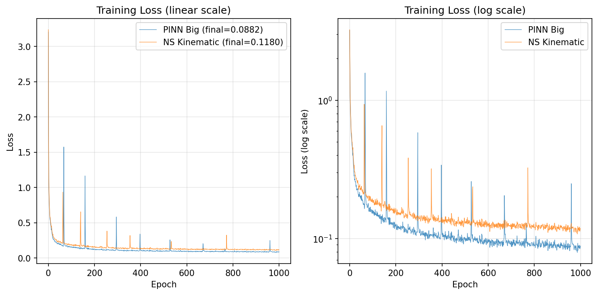

# 组会汇报 — 6-10
---

## 1. 背景

**目标**：将 WRF 3km 分辨率三维风场超分至 1km。

**模型输入**：

| 类别 | 变量 | 说明 |
|------|------|------|
| LR 风场 (18ch) | U,V,W × ml0,ml1,ml2,ml3,ml5,ml10 | 3km 分辨率，bicubic 上采样至 1km 网格 |
| 条件变量 (9ch) | t2, z, lu, tsk, swdown, glw, hfx, lh, psfc | 2m气温、地形高度、土地利用、地表温度、短波/长波辐射、感热/潜热通量、地表气压 |

共 27 个输入通道（18 + 9），条件变量不包含 PBLH（消融实验已证明该变量贡献最弱）。

**模型输出**：

18 个通道 — HR 风场 U,V,W × 6 个高度层（ml0/ml1/ml2/ml3/ml5/ml10，对应约 30m~10km）。

**数据划分**：70% train / 14.5% valid / 15.5% test，标准化采用逐变量 (x − bias) / scale。

---

### 1.1 加完整NS方程的问题

受限于三维气压场和多时次数据的缺失，NS 动量方程的三条均无法施加。目前可用的物理约束仅限于连续性方程与涡度约束，两者共同构成 NS 方程的运动学骨架。

NS 方程包含 **4 条方程**，3 条动量 + 1 条连续性：

| NS 方程项 | 需要的数据 | 当前数据集是否具备 |
|-----------|-----------|:------:|
| 时间导数项 ∂U/∂t 等 | 多时次风场 | 目前dataloader不支持，需要重构训练方式 |
| 平流项 U·∇U 等 | 三维风场梯度 | 部分具备，但 6 层垂直分辨率不足 |
| 气压梯度力 −(1/ρ)∇p | 三维气压场 | 仅有地表气压 PSFC |
| 湍流粘性项 ν∇²U | 涡粘系数 | 需要WRF额外输出TKE，KM，KH等变量 |
| 科氏力项 fV, −fU | 纬度 | 具备 |
| 连续性方程 ∇·u = 0 | 三维风场 | 具备 |

---

### 1.2 前期消融实验

通过 5 组消融实验系统评估了 10 个条件变量的贡献（128×128, inner_ch=32, CPU）：

| 消融配置 | 去掉的变量 | 对 U RMSE 影响 | 结论 |
|------|------|:---:|------|
| NoTerrain | HGT + LU_INDEX | **+0.065** | 地形最重要 |
| NoThermal | T2,TSK,SWDOWN,GLW,HFX,LH | +0.007 | 有一定贡献 |
| NoPBLH | PBLH | −0.026 | 贡献最弱，去掉反而略好 |
| NoPressure | PSFC | −0.006 | 贡献最弱 |

**条件变量重要性：地形 >> 热力变量 > 气压 ≈ PBLH**

此外，W 分量量级比 U/V 小 1-2 数量级，不加权时模型几乎忽略 W。**W 加权（channel_weights ×10）**使 W SSIM 从 0.345 提升至 0.601（↑74%）。

基于以上发现，后续所有模型统一采用：**去掉 PBLH（9 条件变量）+ W 加权 ×10**。

---

### 1.3当前实验模型详细训练参数和架构对比

| 参数 | PINN-base | PINN-large | **PINN-NS** |
|------|:---:|:---:|:---:|
| 分辨率 | 128×128 | 192×192 | **192×192** |
| 模型通道数 | 32 | 64 | **64** |
| 参数量 | ~1.2M | ~4.8M | **~4.8M** |
| 条件变量 | 9 (NoPBLH) | 9 (NoPBLH) | 9 (NoPBLH) |
| W 加权 | ×10 | ×10 | ×10 |
| 物理约束 | 水平散度 λ=0.1 | 水平散度 λ=0.1 | **三维散度 λ=0.1 + 涡度 λ=0.05** |
| Epochs | 400 | 1000 | **1000** |
| 设备 | CPU | GPU | **GPU** |
| GPU | — | RTX 3090 24GB | RTX 3090 24GB |
| 训练时长 | ~12h | ~3.5h (1000轮) | ~3.5h (1000轮) |

**模型架构**：UNet + Attention，channel_mults=[1,2,4,8,8]，res_blocks=1，dropout=0.2。输入 27ch → 输出 18ch。512× 隐层维度（inner_ch=64 时）。

### 1.4 Loss 函数演进

| 模型 | Loss 组成 |
|------|---------|
| PINN 小/大模型 | L_data + 0.1 × mean((∂U/∂x + ∂V/∂y)²) |
| **PINN-NS** | L_data + 0.1 × mean((∂U/∂x + ∂V/∂y + **∂W/∂z**)²) + 0.05 × mean(ζ²_coarse) |

PINN-NS 新增：
- **∂W/∂z 项**：补齐三维连续性方程
- **涡度约束 ζ = ∂V/∂x − ∂U/∂y**：avg_pool 提取大尺度分量，约束模型不引入虚假旋转

两项合起来覆盖了 NS 方程的**运动学骨架**，Helmholtz 分解：散度 + 涡度完整描述流场结构。

---

### 1.5 实际训练 Loss 对比

| 阶段 | PINN-base | PINN-large | PINN-NS |
|------|:----------:|:----------:|:----------:|
| 初始 | 2.645 | 3.205 | 3.236 |
| Epoch 50 | 0.369 | 0.190 | 0.228 |
| Epoch 200 | 0.240 | 0.127 | 0.165 |
| Epoch 600 | — | 0.094 | 0.124 |
| **Epoch 1000** | — | **0.087** | **0.118** |

> PINN-NS 的 loss 数值比 PINN-large 高约 0.03，是因为 Loss 函数多了涡度惩罚项，两者**不能直接比数值大小**。两条曲线都稳定收敛，PINN-NS 未出现发散或 NaN。

---

## 2. 测试集评估

### 2.1 按风分量：PINN-large vs NS

| 分量 | PINN-large | PINN-NS | 变化 |
|:---:|:----------:|:----------:|:----:|
| U RMSE | 0.762 | 0.808 | +6.0% |
| V RMSE | 0.551 | 0.573 | +4.1% |
| **W RMSE** | 0.121 | 0.122 | +0.3% |
| Overall RMSE | 0.478 | 0.501 | +4.8% |

| 分量 | PINN-large SSIM | PINN-NS SSIM | 变化 |
|:---:|:--------------:|:----------:|:----:|
| U | 0.545 | 0.531 | −2.6% |
| V | 0.580 | 0.576 | −0.7% |
| **W** | 0.696 | **0.701** | +0.7% |

从 RMSE 看，PINN-NS 在 U/V 分量上略逊于 PINN-large（+4~6%），W 分量基本持平。从 SSIM 看，两模型空间结构能力相当，PINN-NS 在 W 分量上有微弱优势。总体而言，PINN-NS 加入的涡度约束以轻微的数据拟合损失换取了 W 分量结构质量的提升。

> **RMSE vs SSIM**：RMSE 衡量像素值差多少，SSIM（结构相似性，范围 0~1）衡量空间格局像不像。高 SSIM 意味着风场的高/低值分布位置正确，不只是数值凑巧接近。

### 2.2 PINN-NS 的改善点

**V 分量 Bias 大幅降低：**

| 通道 | PINN-large Bias | PINN-NS Bias | 改善 |
|:-----|:-----------:|:------:|:----:|
| V ml0 | +0.165 | **+0.002** | 趋近零 |
| V ml1 | +0.123 | **+0.017** | 趋近零 |
| V ml2 | +0.075 | +0.053 | ↓29% |

近地面层（ml0/ml1）的 V 分量 bias 几乎被消除，这是涡度约束的直接效果——约束 ∂V/∂x−∂U/∂y 的大尺度结构，抑制了系统性偏置。

> **Bias 说明**：Bias = 模型预测均值 − 真实均值，正值表示模型整体高估。Bias 贡献了 RMSE 的一部分（RMSE² = Bias² + 随机误差²），降低 Bias 可以直接改善 RMSE。

**W SSIM 略升：** 0.696 → 0.701

### 2.3 按高度层

| 层 | PINN-large | NS | 变化 | 说明 |
|:---:|:------:|:---:|:----:|------|
| **ml0** | 0.421 | **0.402** | **↓4.5%** | 近地面改善 |
| ml1 | 0.497 | 0.543 | +9.3% | |
| ml2 | 0.456 | 0.455 | −0.2% | 持平 |
| ml3 | 0.474 | 0.507 | +6.9% | |
| ml5 | 0.522 | 0.555 | +6.3% | |
| ml10 | 0.545 | 0.655 | +20.2% | 高空退化严重 |

**PINN-NS 约束在近地面层有效，高空层出现退化。** 可能原因：高空风场接近地转平衡，气压梯度力与科氏力平衡，纯运动学约束（散度及涡度）无法完整描述该平衡关系。

### 2.4 三模型综合排名

| 排名 | 模型 | Overall RMSE | 特点 |
|:----:|------|:-----------:|------|
| 1 | **PINN-large** | **0.478** | 综合最优 |
| 2 | PINN-NS | 0.501 | V bias 最低，近地面最优 |
| 3 | PINN-base | 0.585 | 基准模型 |

从 PINN-base 到 PINN-large，模型规模和分辨率的提升带来了 18.3% 的 RMSE 降幅，效果显著。PINN-NS 在此基础上以 4.8% 的 RMSE 代价换取了更好的物理一致性。

---

## 3. 昼夜分组分析 PINN-large

按 swdown向下短波辐射，将测试集分为白天>50 W/m² 的 和 夜间<5 W/m²：

| 分量 | 白天 RMSE | 夜间 RMSE | 夜间改善 |
|:---:|:---------------:|:---------------:|:--------:|
| U | 0.760 | 0.766 | 持平 |
| V | 0.574 | **0.525** | ↓9% |
| **W** | 0.147 | **0.088** | **↓40%** |

**夜间 W 分量 RMSE 比白天低 40%**。白天热对流活跃、垂直运动复杂，夜间边界层稳定，风场更平滑。

---

## 4. 下一步工作

### 4.1 效果总结

1. **PINN-large** 综合指标最优，RMSE 0.478，相对 PINN-base 下降 21%
2. **PINN-NS** 在物理一致性上更优，近地面 V bias 趋近于零，ml0 层 RMSE 改善 4.5%，但高空层退化和整体 RMSE 略高

### 4.1 模型目前的主要问题

1. **PINN-large 存在 U/V 系统性高估**：U bias +0.134, V bias +0.067，可通过后处理 debiasing 修正
2. **PINN-NS 整体 RMSE 略高于 PINN-large**（+4.8%），物理约束改善了 V bias 但降低了数据拟合精度
3. **PINN-NS 高空性能退化**：ml10 层 RMSE 增加 20%，可能与高空地转平衡占主导有关，运动学约束在此条件下不完全适用
4. **涡度权重可能偏高**：λ_vort=0.05 的约束强度可进一步调低至 0.01~0.02

下一步

1. PINN-NS 昼夜分组，和 PINN-large 一样的昼夜分析，看涡度约束是否夜间改善更多
2. 按地形分类，按 LU_INDEX 或 HGT 将测试集分为山地/平原/城市等，分别评估
3. 修改分层物理约束，只在 ml0-ml3（低层）加涡度约束，ml5/ml10 不加
4. 修改训练方式，增加时间导数 ∂U/∂t，dataloader 配对 t 和 t+1h，加入时间导数约束
5. 增加3D气压数据，从wrf输出导出到npz过程中添加各层气压