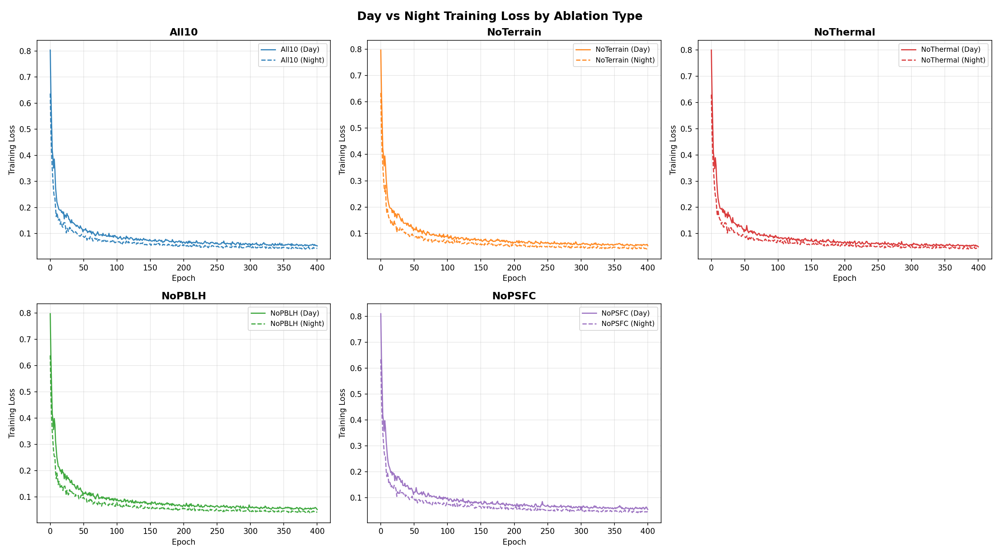
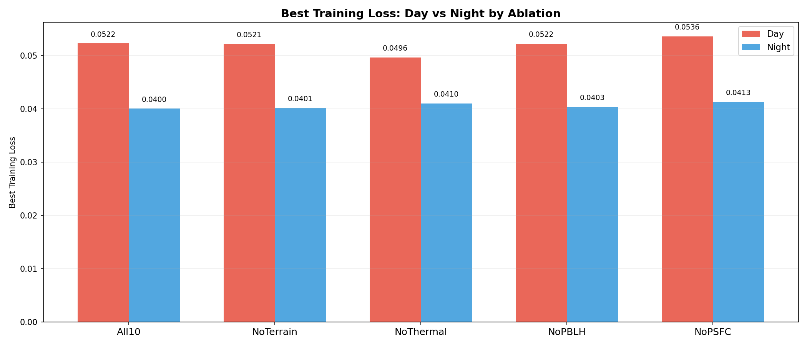

# 组会汇报 — 昼夜消融实验与相关工作

---

## 一、相关工作：我们的方法与经典 PINN、扩散降尺度的区别

**仅加连续性方程**

- Cervantes & Moreles (2024)：从稀疏 LiDAR 数据重建三维风场，仅约束质量守恒 ∇·u = 0，无涡度、无动量。
- Mendez et al. (2024)：RBF 回归做速度场超分，∇·u = 0 作为硬约束，同时针对势流加了 ∇×u = 0 但不是通用的涡度约束。

**散度 + 涡度**

- Gormezano & Shadden (APS DFD, 2024)：用 Markov Random Field 做流场超分，约束项为连续性方程 + 涡度方程，与我们的组合完全一致。区别在于他们用贝叶斯框架无需训练数据，我们在 diffusion 框架下用有限差分。

**散度 + 动量方程（稳态，无时间导数）**

- Gao, Sun & Wang (Physics of Fluids, 2021)：CNN 无标签超分，施加稳态不可压 NS 的连续性项和动量项。没有 ∂u/∂t 项，但需要压力场和涡粘系数，属于比我们更重的物理约束。
- Eivazi, Wang & Vinuesa (2024)：PINN 做时空超分，加质量守恒和动量守恒，但需要 collocation points 和自动微分。

**约束方案对比**

| 工作 | 约束项 | 计算方式 | 需要压力 |
|------|------|:---:|:---:|
| Cervantes (2024) | ∇·u = 0 | 自动微分 | 否 |
| Mendez (2024) | ∇·u = 0 + ∇×u = 0 (势流) | RBF 解析 | 否 |
| Gormezano (2024) | ∇·u = 0 + ∇×u ≠ 0 | 离散近似 | 否 |
| **本实验** | **∇·u = 0 + ζ\_coarse = 0** | **中心差分** | **否** |
| Gao (2021) | ∇·u = 0 + 动量 (稳态) | 有限差分 | 是 |
| Eivazi (2024) | ∇·u = 0 + 动量 + 边界 | 自动微分 | 是 |
| NSFnets (2021) | 全部 4 条 NS 方程 | 自动微分 | 是 |

我们的方案与 Gormazano 最接近，均采用散度+涡度双约束，均不需要压力场和时序数据。区别在于我们对涡度施加 AvgPool 仅约束大尺度分量，避免小尺度噪声干扰；此外我们基于 Stochastic Interpolant 扩散框架实现超分，而非贝叶斯反演。

---

## 二、昼夜分组消融实验

### 2.1 实验动机

前期全天消融实验得出**地形 >> 热力 > 气压 ≈ PBLH**的结论，但这是全天平均的结果。此前 PINN-large 的昼夜分析已发现夜间 W 分量 RMSE 比白天低 40%，夜间边界层稳定、风场更平滑。

白天和夜间的物理过程完全不同——白天地表加热驱动对流，热力变量理应更重要；夜间辐射冷却，地形对冷空气堆积起关键作用。核心问题：哪些条件变量在白天/夜间重要

### 2.2 实验设计

沿用原消融实验的轻量配置：128×128 分辨率，inner_channel=32，纯 L2 loss，400 epochs，GPU 训练。

| 消融配置 | 去掉的变量 | 变量数 | 白天假设 | 夜间假设 |
|---------|------|:---:|---------|---------|
| All10 | 无 | 10 | — | — |
| NoTerrain | z + lu | 8 | 热力主导，地形影响弱 | 地形驱动冷空气堆积，可能更重要 |
| NoThermal | t2+tsk+swdown+glw+hfx+lh | 4 | 热力关键，去掉应显著恶化 | 辐射≈0，去掉应影响小 |
| NoPBLH | pblh | 9 | 边界层深厚，可能有价值 | 边界层稳定，意义不大 |
| NoPSFC | psfc | 9 | 气压梯度驱动风场，可能有用 | 弱风条件下作用减弱 |

昼夜划分标准：swdown > 50 W/m² 为白天，swdown < 5 W/m² 为夜间，过渡时段排除。每组训练数据量：

| 时段 | 训练 | 验证 | 测试 |
|:---:|:---:|:---:|:---:|
| 白天 | 167 | 36 | 37 |
| 夜间 | 146 | 30 | 35 |

共 5 × 2 = 10 组实验。全天总样本 480 个，排除过渡时段后约 313 个。

### 2.3 训练 Loss

10 组实验均稳定收敛至 400 epochs。三个观察：

1. 夜间模型 loss 普遍更低，约 0.04 vs 白天 0.05，符合夜间风场更平滑的预期
2. 白天 NoThermal 训练 loss 最低（0.0496），低于 All10（0.0522），去掉热力变量后模型学习变简单了
3. 白天 NoPSFC 训练 loss 最高（0.0536），气压变量对训练有微弱贡献

训练 loss 跨消融配置不可直接比较，因为 in_channel 不同（22~28）导致模型参数量不同，最终以测试集 RMSE 为准。

---

## 三、测试集评估

### 3.1 Overall RMSE

| Ablation | 白天 RMSE | 夜间 RMSE | 夜间/白天 |
|---------|:--------:|:--------:|:------:|
| All10 | 0.3557 | 0.2710 | 76% |
| NoTerrain | 0.3480 | 0.2729 | 78% |
| NoThermal | 0.3490 | 0.2721 | 78% |
| NoPBLH | 0.3571 | 0.2728 | 76% |
| NoPSFC | 0.3584 | 0.2700 | 75% |

RMSE 为标准化后的值，仅用于相对比较。夜间模型整体优于白天约 24%，与 PINN-large 的发现一致。

### 3.2 ΔRMSE — 去除各变量的性能变化

| Ablation | 白天 ΔRMSE | 夜间 ΔRMSE | 解读 |
|---------|:--------:|:--------:|------|
| NoTerrain | −0.0077 | +0.0019 | 白天去地形后略好 |
| NoThermal | −0.0067 | +0.0011 | 白天去热力后略好 |
| NoPBLH | +0.0015 | +0.0019 | 昼夜均无影响 |
| NoPSFC | +0.0027 | −0.0010 | 无影响 |

所有 ΔRMSE 绝对值均 < 1%，处于噪声水平。在小模型尺度下，条件变量的选择对预测精度影响不显著。

### 3.3 与之前全天消融的对比

| 实验 | 模型 | 训练样本 | NoTerrain Δ | 结论 |
|------|------|:---:|:---:|------|
| 全天消融 | 128×128, 32ch | 335 | +0.065 (物理空间) | 地形最重要 |
| 昼夜分组 | 128×128, 32ch | 167/146 | −0.008 (归一化) | 均不显著 |

全天消融中地形贡献显著（+0.065 U RMSE m/s），但昼夜分组将数据量减半后，所有变量贡献均退化为噪声水平。

### 3.4 W 分量

| Ablation | 白天 W RMSE | 夜间 W RMSE | 夜间改善 |
|---------|:----------:|:----------:|:------:|
| All10 | 0.731 | 0.483 | −34% |
| NoTerrain | 0.711 | 0.487 | −31% |
| NoThermal | 0.710 | 0.477 | −33% |
| NoPBLH | 0.725 | 0.484 | −33% |
| NoPSFC | 0.731 | 0.476 | −35% |

夜间 W 分量 RMSE 比白天低约 34%，与之前 PINN-large 的 40% 差距一致，是跨模型尺度的稳健现象。夜间稳定边界层中垂直运动弱且规则，预测难度远低于白天的活跃对流。

### 3.5 SSIM

| Ablation | 白天 SSIM | 夜间 SSIM |
|---------|:--------:|:--------:|
| All10 | 0.828 | 0.946 |
| NoTerrain | 0.912 | 0.975 |
| NoThermal | 0.946 | 0.973 |
| NoPBLH | 0.816 | 0.976 |
| NoPSFC | 0.782 | 0.974 |

夜间 SSIM 均在 0.97 以上，空间结构重建质量远优于白天。白天 NoPSFC 的 SSIM 偏低（0.78），气压场缺失可能影响了高空层风场空间结构。

---

## 四、总结与下一步

### 主要发现

1. 昼夜预测难度差距是稳健的：夜间 RMSE 比白天低 24%，W 分量低 34%，与模型尺度和消融配置无关
2. 条件变量的昼夜差异不显著：在小模型和减半数据量下，去除任何一组变量的影响都在噪声范围内
3. 白天 NoThermal 和 NoTerrain 的微小改善说明：热力和地形变量内部高度相关，在小数据量下可能引入噪声

### 限制因素

- 训练数据量减半（167/146），统计显著性受限
- 模型容量 1.2M 参数，可能不足以同时利用 10 个条件通道
- 测试集仅 37/35 样本，单样本波动影响较大

### 下一步

1. 大模型昼夜消融：192×192、inner_ch=64，验证模型容量是否是限制因素
2. 全天训练 + 昼夜评估：用全量数据训练，评估时再分昼夜，保证训练数据量
3. 深圳新数据集：老师提供的 WRF d04 高分辨率输出（1km、10-min），可能支持完整 NS 动量方程约束，脚本已准备待执行
